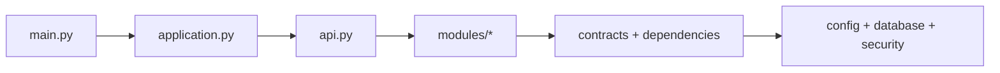

# ADR-001 — Adaptación crítica de `backend_v3`

Fecha: 30 de julio de 2026

Estado: **Aceptada e implementada**

Trazabilidad: [EN-005 / Back #58](https://github.com/jeffangeloss/IQBF-ULIMA_Back/issues/58)

## Contexto

Se revisó minuciosamente la referencia local
`PROYECTO_IQBF/backend_v3`, compuesta por:

- backend Flask/SQLAlchemy con `main`, módulos `admin` y `biblio`,
  blueprints, APIs, vistas, migraciones y frontend React/Vite;
- cliente Flutter `BiblioUL` con `models`, `repositories`, `services`,
  `responses`, controladores y páginas;
- documentación de esquema, despliegue, casos de uso y mockups.

La referencia demuestra una intención correcta: separar composición,
capacidades, acceso externo, presentación y persistencia. No se copia
literalmente porque varias decisiones son inseguras o están ligadas a un
prototipo educativo.

## Decisión

Se adopta la organización **por capacidad de negocio**, con un composition root
explícito y dependencias dirigidas hacia contratos transversales:

```text
app/main.py              entrada ASGI, sin reglas
app/application.py       fábrica, middleware, errores, CORS y ciclo de vida
app/api.py               registro único de routers
app/contracts.py         problem+json, salud, paginación y Decimal
app/modules/
  auth/                  sesión y contratos de identidad
  users/                 cuentas, roles y alcances
  catalogs/              catálogos institucionales
  insumos/               insumos, presentaciones y densidades
app/config.py             configuración validada
app/database.py           pool y transacción por solicitud
app/dependencies.py       identidad, conexión y RBAC
migrations/              integridad y evolución PostgreSQL
tests/                    aceptación + guardas de arquitectura
```

En frontend se adopta la intención `page/controller/service/repository` como
fronteras `app/features/api/shared`, adecuada a React:

```text
src/app/                 composition root y shell
src/features/auth/       sesión, permisos y login
src/features/catalogos/  UI del caso de uso
src/features/cuentas/    UI del caso de uso
src/features/insumos/    UI del caso de uso
src/api/                 transporte y contrato OpenAPI generado
src/shared/              componentes y funciones sin negocio
```

## Matriz de adopción

| Hallazgo en la referencia | Decisión IQBF | Implementación/evidencia |
|---|---|---|
| Blueprints agrupados por dominio y registro central | Adoptar | `app/modules/*/router.py` + `app/api.py` |
| Separación Flutter de modelo, servicio, repositorio, controlador y página | Adaptar a feature slices React | `src/features`, `src/api`, `src/shared`, `src/app` |
| Alias `@` de Vite | Adoptar | `vite.config.ts` e imports desde features |
| Migraciones versionadas y DER/documentos | Adoptar y reforzar | `migrations/`, `specs/`, Core V3 y pruebas de doble aplicación |
| Instancia Flask `APP` global | Rechazar | `create_app()` construye instancias aisladas; `main.py` solo expone ASGI |
| Sesión SQLAlchemy creada manualmente en cada endpoint | Adaptar | pool PostgreSQL en lifespan y transacción inyectada por solicitud |
| `to_dict()` en modelos ORM | Rechazar | contratos Pydantic explícitos; no serialización accidental de campos |
| Respuesta genérica `{success,data,error}` | Adaptar | éxitos tipados + errores RFC `application/problem+json` |
| Secretos JWT/Flask incrustados | Rechazar | `BaseSettings`, `SecretStr`, fallo de arranque y ejemplos sin credenciales |
| Contraseñas comparadas en texto plano | Rechazar | hash Argon2 y verificación segura |
| Tokens impresos en consola | Rechazar | bitácora por `request_id`; nunca token/contraseña |
| Lista de tokens revocados en memoria | Rechazar | sesiones persistidas/revocadas en PostgreSQL |
| `except Exception` devuelve `str(e)` al cliente | Rechazar | mensaje público redactado y stack trace solo en logger del servidor |
| SQLite y `echo=True` | Rechazar para IQBF | PostgreSQL, precisión `NUMERIC`, pool y logs explícitos |
| Subidas sin política de tipo/tamaño | No adoptar | futura evidencia tendrá allowlist, límites y almacenamiento seguro |
| React con entries/layouts/pages/widgets/services | Adaptar | un entry, shell, features, shared y API tipada |

## Reglas de dependencia



- `main.py` no importa módulos de negocio.
- Un módulo no importa el `router` de otro.
- Solo `app/api.py` conoce todos los routers.
- `shared` del frontend no depende de `features` ni de `app`.
- Las features no realizan `fetch`; todo HTTP pasa por `src/api`.
- La interfaz puede ocultar acciones, pero el backend vuelve a autorizar cada
  solicitud.

Estas reglas se ejecutan en `tests/test_architecture.py` y
`scripts/check-architecture.mjs`.

## Decisiones específicas del dominio

- El kardex es inmutable y la corrección es compensatoria.
- Masa, saldo y equivalencias usan decimales exactos; nunca `float`.
- La densidad se versiona y se congela en el hecho operacional.
- Rol y alcance son controles independientes.
- El contrato OpenAPI genera tipos del frontend; no se duplican interfaces.
- Excel histórico es evidencia de reconciliación, no fuente automática de
  reglas ni valores faltantes.
- Las migraciones pueden repetirse sin reinstalar o borrar el Core V3.

## Deuda visible y controlada

1. `src/app/App.tsx` conserva el mockup S2/S4 y sus datos ficticios en un archivo
   grande. Está rotulado como demo, no escribe en la API y debe separarse al
   implementar inventario/consumo.
2. Las vistas S1 ya viven por feature, pero algunos formularios extensos
   requieren extracción a componentes/hooks al recibir nuevas historias.
3. Los routers `catalogs` e `insumos` aún contienen consultas y orquestación
   cohesivas en el mismo módulo; se extraerán repositorios cuando esos dominios
   crezcan, sin crear capas vacías prematuramente.
4. La comparación celda a celda del RM04 sigue bloqueada según EN-004.

Estas brechas deben conservarse como issues técnicos antes de ampliar los
módulos afectados.

## Verificación

```bash
cd IQBF-ULIMA_Back
python -m pytest -q

cd ../IQBF-ULIMA_Front
npm run arch:check
npm run typecheck
npm run build
```

La ADR se considera incumplida si cualquiera de esas guardas falla.
