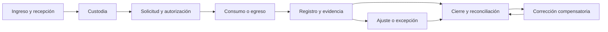

# EN-001 — Mapa TO-BE y actores

Issue: [IQBF-ULIMA_Front #1](https://github.com/jeffangeloss/IQBF-ULIMA_Front/issues/1)

Sprint: S0 — 15 al 28 de julio de 2026

Estado técnico: **En revisión**

## Objetivo

Definir el proceso futuro de control IQBF desde el ingreso hasta el cierre y
la corrección, con actor, entrada, salida, estado y evidencia auditable para
cada paso. Este documento complementa el BPMN inicial y es el contrato
funcional canónico mientras se prepara su versión diagramada definitiva.

## Actores

| Actor | Responsabilidad principal |
|---|---|
| Responsable IQBF | Gobierno del proceso, cierre, reversión, maestros y conformidad institucional |
| Operador de Docimasia | Recepción, custodia operativa y registro de movimientos dentro de su alcance |
| Docente/Investigador | Solicitud y justificación del uso, con evidencia del trabajo autorizado |
| Aprobador | Decisión independiente sobre excesos, excepciones y operaciones sujetas a autorización |
| Auditor | Consulta inmutable, reconciliación y seguimiento de hallazgos; no modifica inventario |
| Administrador técnico | Cuentas, roles, soporte y disponibilidad; no aprueba operaciones IQBF |
| Sistema IQBF | Validaciones, cálculo de saldo, folios, trazabilidad, alertas y bloqueo de reglas |

El alcance organizacional puede ser global, por establecimiento o por
laboratorio. Toda acción se evalúa contra el rol y el alcance asignado a la
cuenta activa.

## Estados comunes

`BORRADOR` → `PENDIENTE_APROBACION` → `AUTORIZADO` → `EN_EJECUCION` →
`REGISTRADO` → `CERRADO`.

Desvíos controlados:

- `OBSERVADO`: faltan datos o evidencia; vuelve a `BORRADOR`.
- `RECHAZADO`: el aprobador niega la operación; no afecta saldo.
- `ANULADO`: solo antes de afectar saldo.
- `REVERTIDO`: una operación registrada se compensa con una nueva operación
  enlazada; el registro original nunca se edita ni elimina.

## Flujo general

## Mapa TO-BE detallado

| Proceso | Disparador y entrada | Actor primario | Validación/decisión | Salida y estado | Evidencia |
|---|---|---|---|---|---|
| Ingreso | Orden, guía, donación o transferencia; insumo, presentación, lote, frascos y cantidades | Operador de Docimasia | Maestro vigente, lote, capacidad, unidad, densidad si es líquido y duplicados | Frascos identificados y movimiento de entrada `REGISTRADO` | Documento fuente, usuario, fecha, folio y saldo resultante |
| Custodia | Frasco recibido o cambio de ubicación/custodio | Operador de Docimasia | Alcance del laboratorio, ubicación habilitada, precinto/QR y responsable receptor | Custodia activa y ubicación trazable | Acta/entrega, custodio anterior y nuevo, fecha y motivo |
| Solicitud de consumo | Trabajo, curso o investigación; insumo, cantidad, fecha y justificación | Docente/Investigador | Elegibilidad, alcance, disponibilidad, vigencia y umbrales | `AUTORIZADO`, `PENDIENTE_APROBACION` u `OBSERVADO` | Solicitante, centro de costo/proyecto, justificación y anexos |
| Autorización | Solicitud que requiere control o supera umbral | Aprobador | No aprobar solicitud propia, evidencia suficiente y saldo disponible | `AUTORIZADO` o `RECHAZADO` con motivo | Decisor, fecha, reglas evaluadas y comentario |
| Consumo | Autorización vigente y frasco seleccionado | Operador de Docimasia | Cantidad positiva, unidad convertible, densidad vigente y no exceder saldo | Salida/consumo `REGISTRADO`; saldo actualizado | Cantidad original, equivalencia en gramos, densidad congelada y usuario |
| Egreso | Devolución, transferencia, disposición o salida autorizada | Operador de Docimasia | Destino, custodio receptor, motivo, soporte y autorización cuando aplique | Movimiento de salida `REGISTRADO`; custodia actualizada | Acta, destino, transportista/receptor, fecha y saldo |
| Ajuste | Diferencia física contra saldo del sistema | Responsable IQBF | Conteo independiente, causa, evidencia y prohibición de editar el kardex | Ajuste compensatorio `REGISTRADO` o caso `OBSERVADO` | Conteo antes/después, causa, aprobador y referencia |
| Excepción | Regla incumplida o cantidad sobre umbral | Aprobador | Segregación de funciones, análisis de riesgo, plazo y compensación | Excepción `AUTORIZADA`, `RECHAZADA` o `VENCIDA` | Regla exceptuada, fundamento, vigencia y aprobador |
| Cierre | Fin de día, periodo o declaración | Responsable IQBF | Operaciones sin resolver, saldos no negativos, integridad, conciliación y diferencias justificadas | Periodo `CERRADO` y versión de reporte inmutable | Hash/versión, totales, diferencias, responsable y fecha |
| Corrección | Error detectado después del registro o cierre | Responsable IQBF | No sobrescribir original; motivo obligatorio; reapertura solo con autorización | Movimiento compensatorio enlazado y, si procede, nueva versión del cierre | Folios original/corrector, motivo, aprobaciones y versiones |

## Puertas de control

1. El sistema rechaza operaciones sin actor autenticado, alcance válido o
   maestro vigente.
2. Una cantidad operacional se conserva en su unidad de origen y se convierte
   a gramos con la regla de EN-002.
3. El solicitante no puede aprobar su propia excepción.
4. Un movimiento registrado no se actualiza ni elimina; se corrige mediante
   un movimiento compensatorio.
5. El cierre bloquea modificaciones del periodo y conserva una versión
   reproducible del consolidado.

## Criterios de aceptación

- [x] El mapa contempla ingreso, consumo, egreso, ajuste, custodia,
  justificación, excepción, cierre y corrección.
- [x] Cada paso tiene actor, entrada, validación, salida/estado y evidencia.
- [ ] El Responsable IQBF dejó constancia de aprobación.

## Acta de conformidad pendiente

La aprobación debe registrarse en el issue con nombre, rol, fecha y decisión.
Hasta entonces, el contenido está listo para revisión pero no se presentará
como aprobado por la institución.
