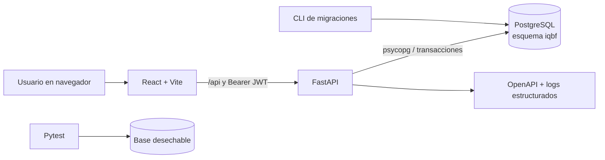

# EN-005 — Arquitectura y ambientes

Issue: [IQBF-ULIMA_Back #58](https://github.com/jeffangeloss/IQBF-ULIMA_Back/issues/58)

Sprint: S0 — 15 al 28 de julio de 2026

Estado técnico: **Hecho**

## Arquitectura



La interfaz consume únicamente el contrato HTTP. El backend concentra
autenticación, autorización, reglas de negocio y transacciones. PostgreSQL
garantiza integridad, precisión decimal y efectos inmutables del kardex.

## Repositorios y módulos

| Repositorio/módulo | Responsabilidad |
|---|---|
| `IQBF-ULIMA_Front/src/app` | Composition root y shell; no transporte HTTP |
| `IQBF-ULIMA_Front/src/features` | Casos de uso por capacidad: auth, catálogos, cuentas e insumos |
| `IQBF-ULIMA_Front/src/api` | Cliente, endpoints y tipos generados desde OpenAPI |
| `IQBF-ULIMA_Front/src/shared` | Componentes y utilidades sin dependencias de negocio |
| `IQBF-ULIMA_Back/app/application.py` | Fábrica, ciclo de vida, middleware y configuración HTTP |
| `IQBF-ULIMA_Back/app/api.py` | Registro único de módulos y endpoint de salud |
| `IQBF-ULIMA_Back/app/modules` | Router y contratos de cada capacidad |
| `IQBF-ULIMA_Back/app/contracts.py` | Contratos transversales y decimales sin pérdida |
| `IQBF-ULIMA_Back/app/database.py` | Pool, transacción y esquema por solicitud |
| `IQBF-ULIMA_Back/migrations` | Evolución incremental, ordenada y reproducible |
| `IQBF-ULIMA_Back/tests` | Aceptación, integración y seguridad |
| `IQBF-ULIMA_Back/specs` | Contrato funcional trazable al backlog |

El archivo versionado `openapi-sprint1.json` es el punto de integración entre
frontend y backend. Todo cambio incompatible debe actualizar OpenAPI, pruebas,
spec e issue en el mismo trabajo.

La comparación completa con el proyecto de referencia del profesor, incluidas
las prácticas que se adoptan, adaptan o rechazan, está en
[`ADR-001`](../architecture/ADR-001-adaptacion-backend-v3.md).

## Convenciones

- Python y módulos en `snake_case`; clases y esquemas en `PascalCase`.
- Endpoints bajo `/api`, recursos en plural y respuestas de error
  `application/problem+json`.
- Todas las solicitudes llevan o reciben `X-Request-ID`.
- Fechas ISO 8601; negocio en `America/Lima`; almacenamiento con zona horaria.
- Valores decimales se serializan como texto; no se usa `float` para saldos.
- Migraciones numeradas y hacia adelante; no se reescribe una migración
  publicada.
- Commits y PR enlazan el issue correspondiente.
- Ningún dato histórico, respaldo, `.env` o credencial se incorpora a Git.
- `main.py` es solo el entrypoint; `api.py` es el único registro de routers.
- Un módulo no importa el router de otro y `shared` no depende de features.

## Separación de ambientes

| Aspecto | Local | Pruebas | Producción |
|---|---|---|---|
| `IQBF_ENVIRONMENT` | `development` | `test` | `production` |
| Configuración ejemplo | `.env.example` | `.env.test.example` | `.env.production.example` |
| Base | PostgreSQL local `iqbf_mvp` | Base vacía y desechable | PostgreSQL administrado con respaldo |
| Datos | Semillas explícitas/desarrollo | Solo datos sintéticos | Datos institucionales |
| Backend | `127.0.0.1:8000`, recarga | Proceso de pytest | ASGI sin `--reload`, HTTPS detrás de proxy |
| Frontend | Vite `127.0.0.1:5173` | Runner de pruebas/build | Artefacto estático versionado |
| Secretos | Archivo `.env` ignorado | Variables efímeras de CI | Gestor de secretos/variables protegidas |
| Migraciones | Manual antes de probar | Automáticas sobre base vacía, dos pasadas | Paso controlado con respaldo y verificación |

Los ambientes no comparten base, usuarios, secretos ni archivos de
configuración. Las pruebas nunca apuntan a una base con datos reales.

## Presupuesto de conexiones

El backend abre un pool de conexiones **por proceso**, en el ciclo de vida de
`app.application`. El consumo total contra PostgreSQL no lo decide el código
sino el despliegue, y debe respetar:

```
IQBF_POOL_MAX_SIZE  x  número de réplicas  <=  max_connections - reserva
```

La reserva (5-10 conexiones) queda para migraciones, respaldos y `psql` de
administración. Escalar réplicas sin bajar `IQBF_POOL_MAX_SIZE` en la misma
proporción agota la base justo bajo carga.

| Réplicas | `IQBF_POOL_MAX_SIZE` | Conexiones | Apto para |
|---|---|---|---|
| 1 | 5 | 5 | Alcance actual del sistema |
| 2 | 5 | 10 | PostgreSQL administrado pequeño |
| 4 | 5 | 20 | Requiere verificar `max_connections` |

Verifique el límite real con `SHOW max_connections;` antes de escalar.

Este modelo asume un **proceso ASGI de vida larga**: el pool se abre una vez al
arrancar y se reutiliza. Un despliegue por funciones efímeras (FaaS) viola ese
supuesto, porque cada instancia abriría su propio pool sin cota global; ahí la
conexión debe delegarse a un pooler externo (PgBouncer en modo transacción o el
endpoint agrupado del proveedor) antes de migrar.

Cuando el pool se agota, la API responde `503` con código `SERVICIO_SATURADO` y
cabecera `Retry-After` tras esperar `IQBF_POOL_TIMEOUT` segundos, en lugar de
colgar la solicitud o informar un error interno.

## Política de secretos

1. Solo se versionan nombres de variables y valores de ejemplo no sensibles.
2. `.env`, respaldos, libros Excel y datos históricos están ignorados.
3. `IQBF_JWT_SECRET` debe ser explícito y tener al menos 32 caracteres fuera
   de desarrollo/pruebas; la aplicación falla al arrancar si no cumple.
4. Producción obtiene credenciales desde variables protegidas o un gestor de
   secretos, con rotación y mínimo privilegio.
5. Contraseñas de usuarios se reciben por entrada segura y se almacenan como
   hash; nunca en scripts, comentarios, logs o issues.
6. Una credencial expuesta se revoca y rota; no basta con borrarla del último
   commit.

## Arranque reproducible local

Desde la raíz `PROYECTO_IQBF`, terminal 1:

```bash
source .venv/bin/activate
python -m pip install -r IQBF-ULIMA_Back/requirements.txt
cd IQBF-ULIMA_Back
cp -n .env.example .env
python -m app.cli migrate
uvicorn app.main:app --reload --host 127.0.0.1 --port 8000
```

Terminal 2, desde la misma raíz:

```bash
cd IQBF-ULIMA_Front
npm install
npm run dev -- --host 127.0.0.1 --port 5173
```

Verificación:

```bash
curl --fail http://127.0.0.1:8000/api/health
curl --fail http://127.0.0.1:5173/
```

Si el puerto 8000 está ocupado, primero identifique el proceso con
`lsof -nP -iTCP:8000 -sTCP:LISTEN`; no inicie una segunda instancia.

## Validación y despliegue

```bash
cd IQBF-ULIMA_Back
source ../.venv/bin/activate
python -m pytest -q
PYTHONPATH=. python scripts/export_openapi.py

cd ../IQBF-ULIMA_Front
npm ci
npm run arch:check
npm run typecheck
npm run build
```

En producción se ejecuta el mismo código versionado, con configuración
inyectada, sin recarga, orígenes CORS explícitos, TLS y migración controlada.

## Criterios de aceptación

- [x] Repositorios, módulos y convenciones están documentados.
- [x] Local, pruebas y producción están separados.
- [x] Los secretos no se guardan en código.
- [x] El arranque y la validación son reproducibles.
- [x] La referencia `backend_v3` fue auditada y cada decisión quedó clasificada
  como adoptada, adaptada o rechazada.
